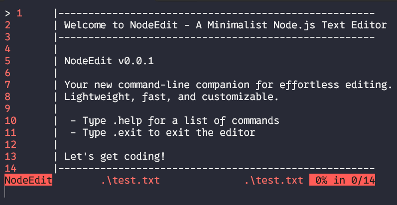

# **Ndit:Powerful and lightweight editor made in javascript**

## **Project Overview**

**Ndit** was made with the main purpose to show to the rest of developers,
how powerful is javascript from the backend side, i've been searching an editor
made in javascript, but there's no one what works very well or stay up to date,
so i decided to make my own editor in javascript. Ndit is a minimalistic
text editor but i'd like to convert it in a more powerful code editor like
neovim, so if you wanna contribute with this project, just push your changes, it
would be a pleasure to work with you, please send me your ideas or something
that you think would help this project to evolve in something bigger.

## **Usage**
you can compile it from source or install it from the npm registry,
if you wanna compile it from the source, you must follow the next steps after
you cloned the repository:

* install the dependencies
```javascript
npm i
```
* execute the build and start script:
```javascript
node --run  start
```

or you can install globally in your system:
```javascript
npm i -g ndit
```

then, you can use it, selecting any file:
```javascript
ndit <your file>
```

## **Screenshots**


